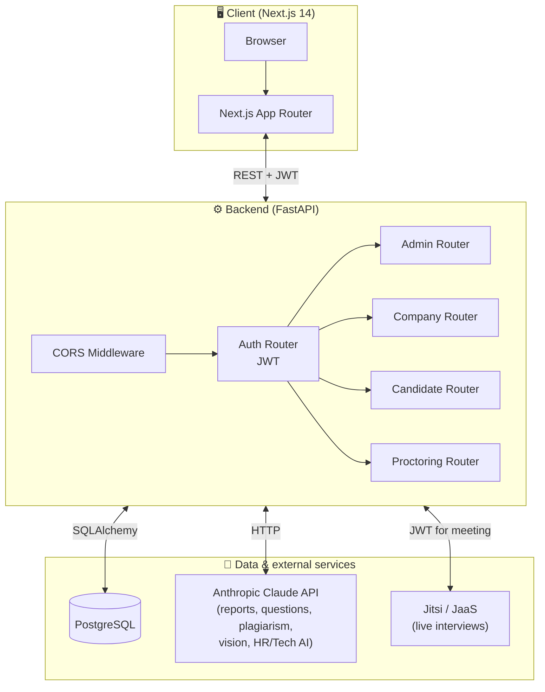
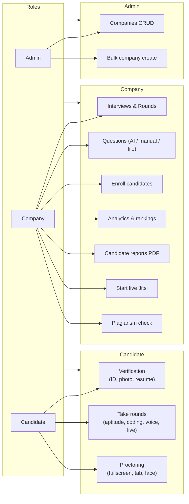
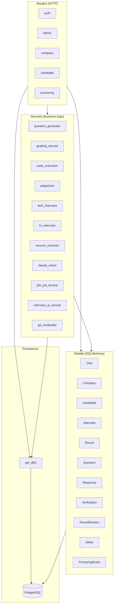
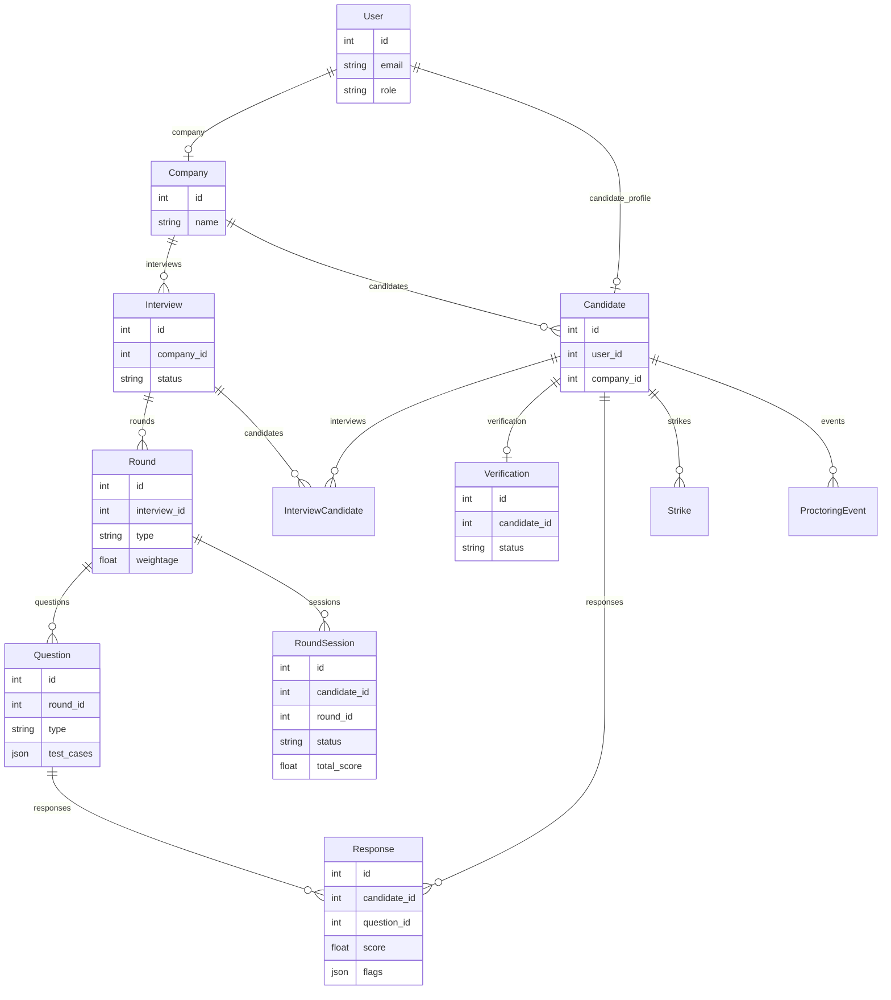
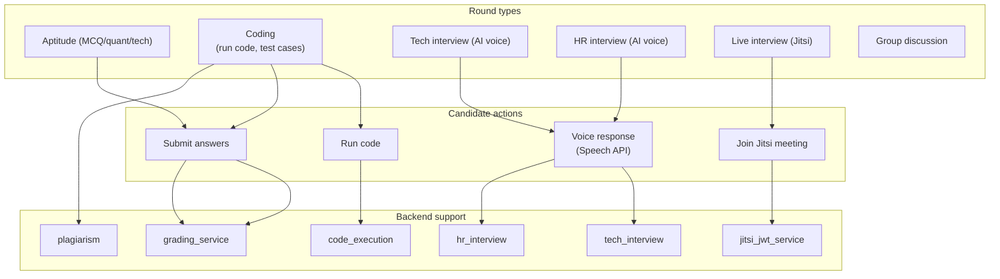
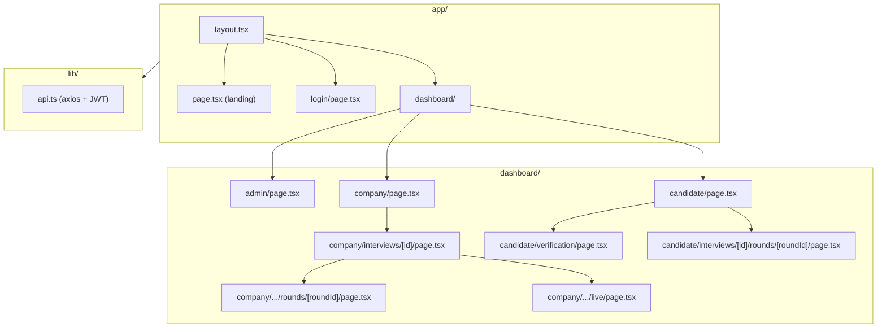
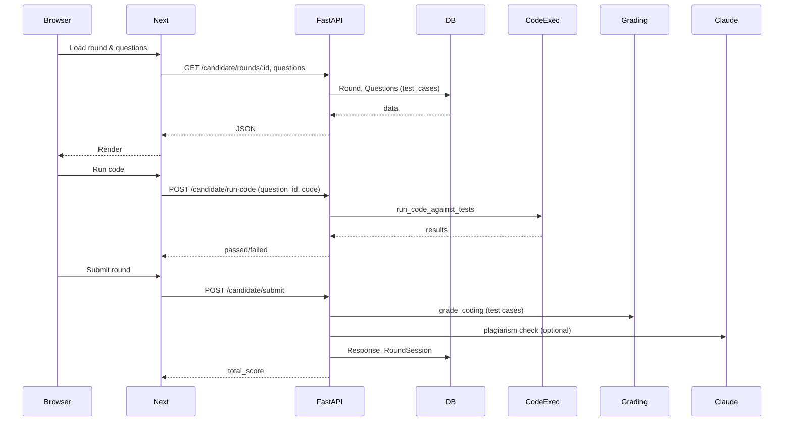

# Neoverse — Architecture Diagram

AI-driven hiring platform: multi-tenant interviews, rounds (aptitude, coding, AI voice, live Jitsi), verification, proctoring, and AI reports.

---

## 1. High-level system architecture

---

## 2. User roles and entry points

---

## 3. Backend layer view

---

## 4. Core data model (simplified)

---

## 5. Round types and flow

---

## 6. Frontend app structure (Next.js App Router)

---

## 7. Request flow (example: candidate takes coding round)

---

## How to view the diagrams

- **In VS Code / Cursor**: Install "Markdown Preview Mermaid Support" and open this file in preview.
- **On GitHub**: Push this file; GitHub renders Mermaid in `.md` files.
- **Export to image**: Use [Mermaid Live Editor](https://mermaid.live/) or `npm run build` with a Mermaid-to-PNG plugin if needed.
